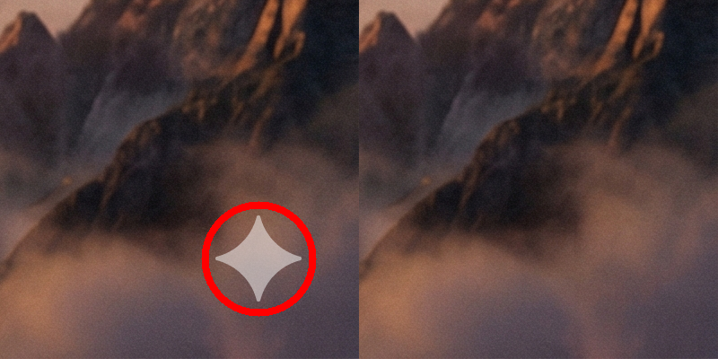

# 🔓 Gemini Watermark Remover

Zero-dependency Go engine to remove Google Gemini watermarks from images and videos. Runs natively on macOS, Windows, and Linux.

## 🎬 Before & After Demos

### Video Watermark Removal (Side-by-Side)


### Image Watermark Removal (Side-by-Side)


---

## 🛠️ Prerequisites

To run this tool, you need the following installed on your system:

1. **Go:** Make sure Go (1.20+) is installed.
2. **FFmpeg:** Required for video processing.
   - **macOS:** `brew install ffmpeg`
   - **Windows:** Download from [ffmpeg.org](https://ffmpeg.org/download.html) and add the binary to your system `PATH`.
   - **Linux:** `sudo apt install ffmpeg`

---

## 🚀 How to Use

Run the commands in your terminal:

```bash
# Process a video or image (overwrites original in-place)
go run . -i input.mp4

# Process a video or image and save it to a new file
go run . -i input.mp4 -o cleaned.mp4
```
